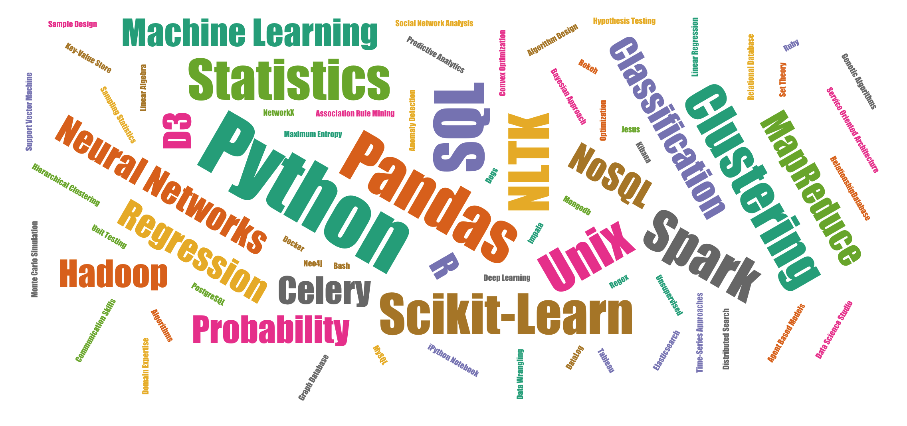

# Topic Maps

**Fast topic survey with associated word cloud visualization on completion.**

[![Build Status][travis_img]][travis_href]
[![Coverage Status][coveralls_img]][coverals_href]
[![Stories in Ready][waffle_img]][waffle_href]

**Fast topic survey with associated word cloud visualization on completion.**

[][results]

## About

From programmers who know statistics, to statisticians who know how to program; everyone that does data science work has their own unique set of skills and tools that they use to get their jobs done. We want to know the essential data science topics that you use in your work.

This application presents a dynamic survey asking about what tools, topics, and techniques you use as a data scientist. The results are then aggregated and visualized in real time. We intend to use this application as a data collection tool for important Data Science topics in the area.

### Contributing

Topic Maps is open source, but because this is an District Data Labs project, we would appreciate it if you would let us know how you intend to use the software (other than simply copying and pasting code so that you can use it in your own projects). If you would like to contribute (especially if you are a student or research labs member at District Data Labs), you can do so in the following ways:

1. Add issues or bugs to the bug tracker: [https://github.com/DistrictDataLabs/topicmaps/issues](https://github.com/DistrictDataLabs/topicmaps/issues)
2. Work on a card on the dev board: [https://waffle.io/DistrictDataLabs/topicmaps](https://waffle.io/DistrictDataLabs/topicmaps)
3. Create a pull request in Github: [https://github.com/DistrictDataLabs/topicmaps/pulls](https://github.com/DistrictDataLabs/topicmaps/pulls)

Note that labels in the Github issues are defined in the blog post: [How we use labels on GitHub Issues at Mediocre Laboratories](https://mediocre.com/forum/topics/how-we-use-labels-on-github-issues-at-mediocre-laboratories).

If you are a member of the District Data Labs Faculty group, you have direct access to the repository, which is set up in a typical production/release/development cycle as described in _[A Successful Git Branching Model](http://nvie.com/posts/a-successful-git-branching-model/)_. A typical workflow is as follows:

1. Select a card from the [dev board](https://waffle.io/DistrictDataLabs/topicmaps) - preferably one that is "ready" then move it to "in-progress".

2. Create a branch off of develop called "feature-[feature name]", work and commit into that branch.

        ~$ git checkout -b feature-myfeature develop

3. Once you are done working (and everything is tested) merge your feature into develop.

        ~$ git checkout develop
        ~$ git merge --no-ff feature-myfeature
        ~$ git branch -d feature-myfeature
        ~$ git push origin develop

4. Repeat. Releases will be routinely pushed into master via release branches, then deployed to the server.

<!-- References -->
[travis_img]: https://travis-ci.org/DistrictDataLabs/topicmaps.svg
[travis_href]: https://travis-ci.org/DistrictDataLabs/topicmaps
[coveralls_img]: https://coveralls.io/repos/DistrictDataLabs/topicmaps/badge.svg?branch=master&service=github
[coverals_href]: https://coveralls.io/github/DistrictDataLabs/topicmaps?branch=master
[waffle_img]: https://badge.waffle.io/DistrictDataLabs/topicmaps.png?label=ready&title=Ready
[waffle_href]: https://waffle.io/DistrictDataLabs/topicmaps
[results]: https://ddl-topicmaps.herokuapp.com/results/
